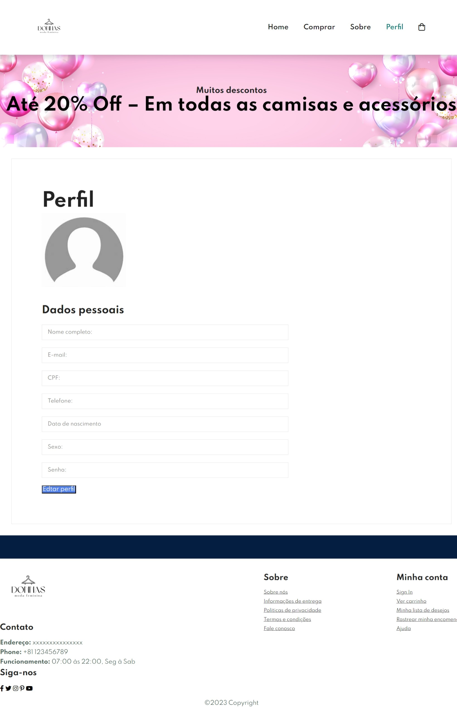

# Projeto Donnas

 

# Sobre o projeto

O projeto Donnas é uma aplicação front end web construída como projeto avaliativo final da cadeira de desenvolvimento web na universidade católica de pernambuco

A aplicação consiste em um ecommerce de moda.

## Layout 
  

# Tecnologias utilizadas
## Front end
- HTML / CSS
  

# Autores

Lucas carneiro de lima, Clara Maria e Helder bernardo 

https://www.linkedin.com/in/wmazoni

 
